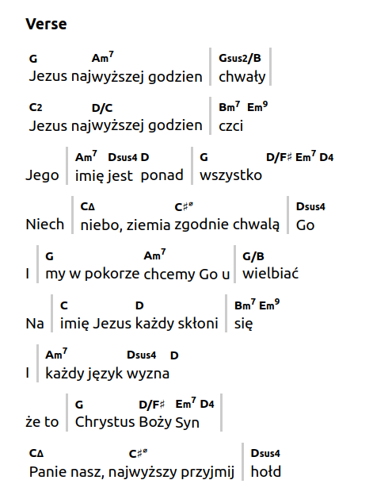
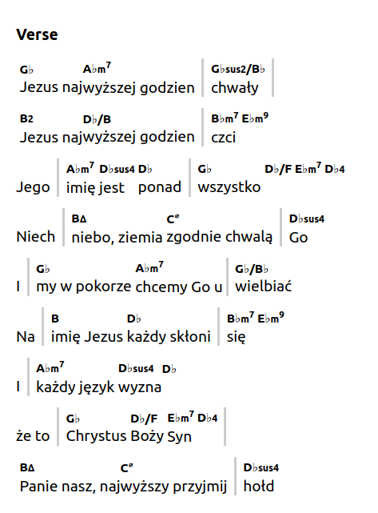
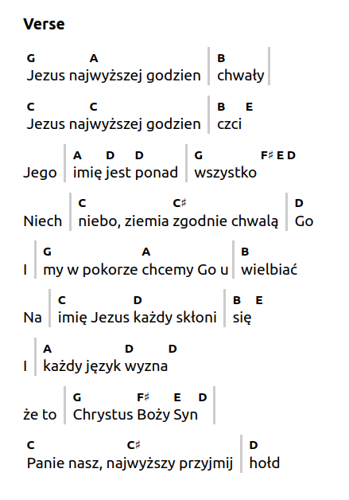
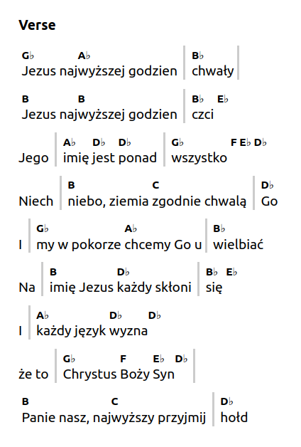

# songs-impoved

## Example
For the following code:
```
{c: Verse}
[G]Jezus naj[Am7]wyższej godzien [|][Gsus2/B]chwały[|]
[C2]Jezus naj[D/C]wyższej godzien [|][Bm7]czci [Em9]
Jego [|][Am7]imię [Dsus4]jest [D]ponad [|][G]wszystko [D/F#][Em7][D4]
Niech [|][Cmaj7]niebo, ziemia [C#m7(b5)]zgodnie chwalą [|][Dsus4]Go

I [|][G]my w pokorze [Am7]chcemy Go u[|][G/B]wielbiać
Na [|][C]imię Jezus [D]każdy skłoni [|][Bm7]się [Em9]
I [|][Am7]każdy język [Dsus4]wyzna[D]
że to [|][G]Chrystus [D/F#]Boży [Em7]Syn[D4][|]
[Cmaj7]Panie nasz, naj[C#m7(b5)]wyższy przyjmij [|][Dsus4]hołd

{c: Chorus}
Wszelka [|][G]władza i [D/F#]moc i ma[|][Em7]jestat
[|][C]Są w rękach [G/B]Twych,[|] [Am7]Są w rękach [Dsus4]Twych[D]
Tak [|][G]władza i [D/F#]moc i [|][Em7]majestat
[|][C]Są w rękach [G/B]Twych, [|][Am7]Są w rękach [D]Twych
Tyś [|][B/D#]Pan i [Em9]Król, [|][Am7]Boży je[Dsus4]dyny [|][G]Syn [|]
```

No additional argumemts:



Transposition -1 semitone:



Bass only:



Bass only & transposition -1 semitone:

